# RogueLike
# RogueLike shooter on Unity #

Be aware, this is an old project for unity 2018.1 that ported to unity 2019.3, something may not work. 
There is a very little documentation made with Doxygen in Russian, search for "index.html" in "Documentation" folder. 
Some comments are in russian. 
Some code may be stupid :) 

## Map generation! ##
* Random generation with room formation preset (cut corners, small room etc.).
* Generation by seed!
* Many settins such as room amount, shops amount, secret room amount, rooms width and height, different chances etc.
* Fully configurable envriments, from walls and tiles to barrels, paintings and torches!
* Configurate it with scriptable objects!

| 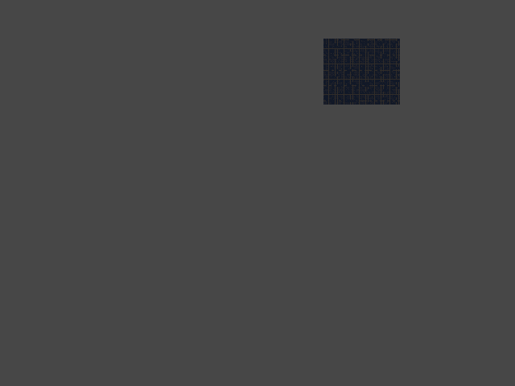 | 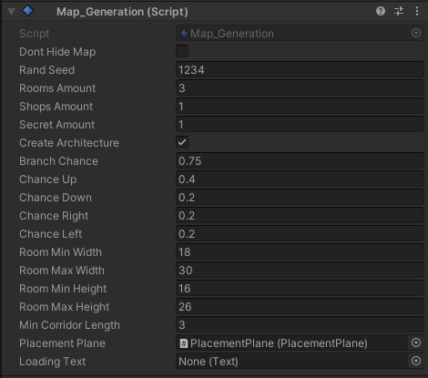 |
|------------------------------------|--------------------------------------|
|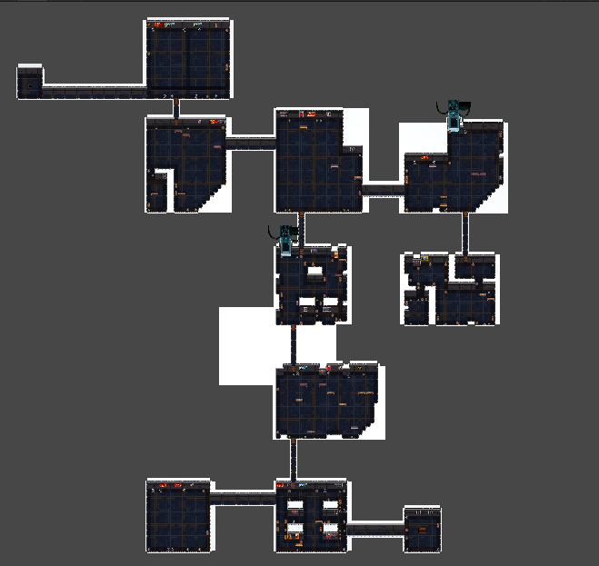|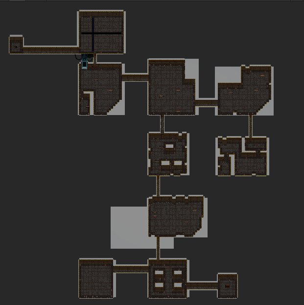|
|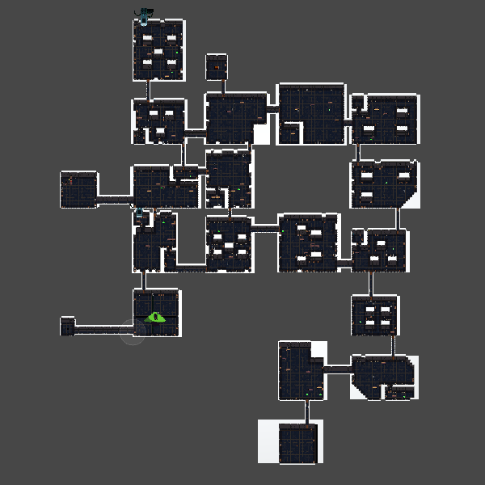|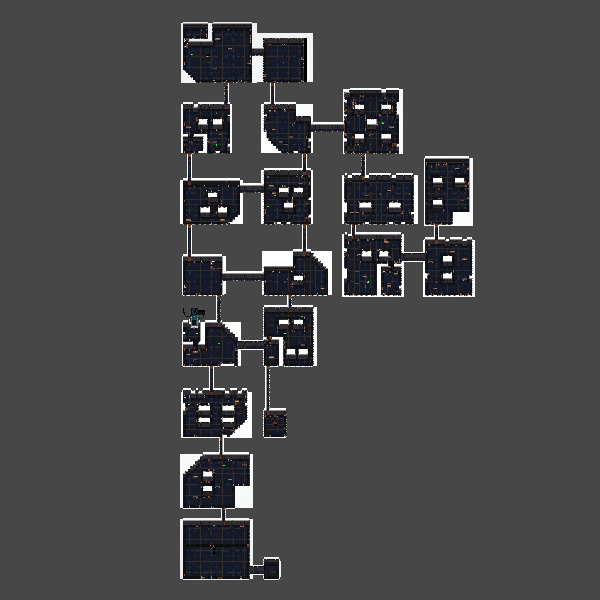|
-----------------------------------------------------------------------------

## Dynamic lights & shadows! ##

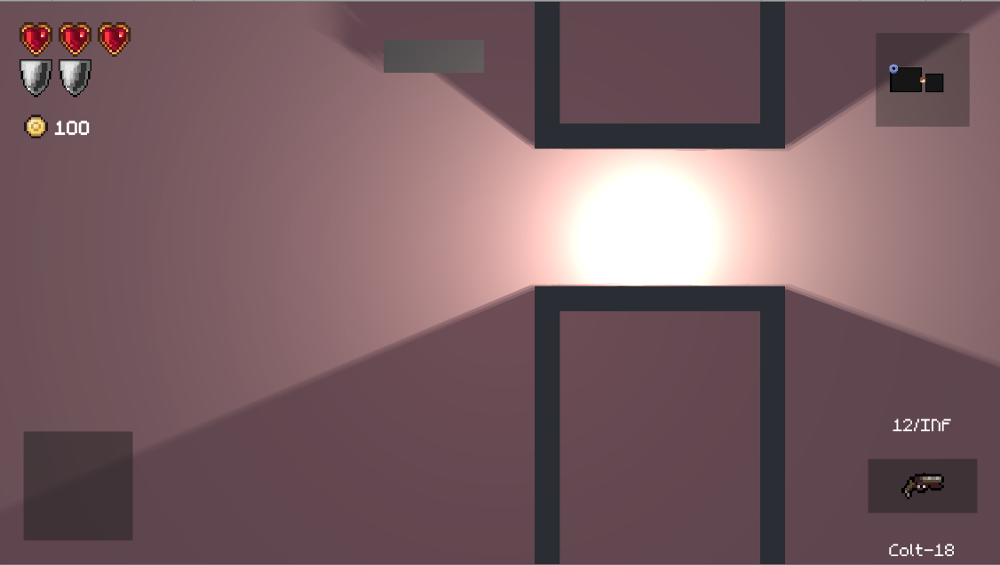 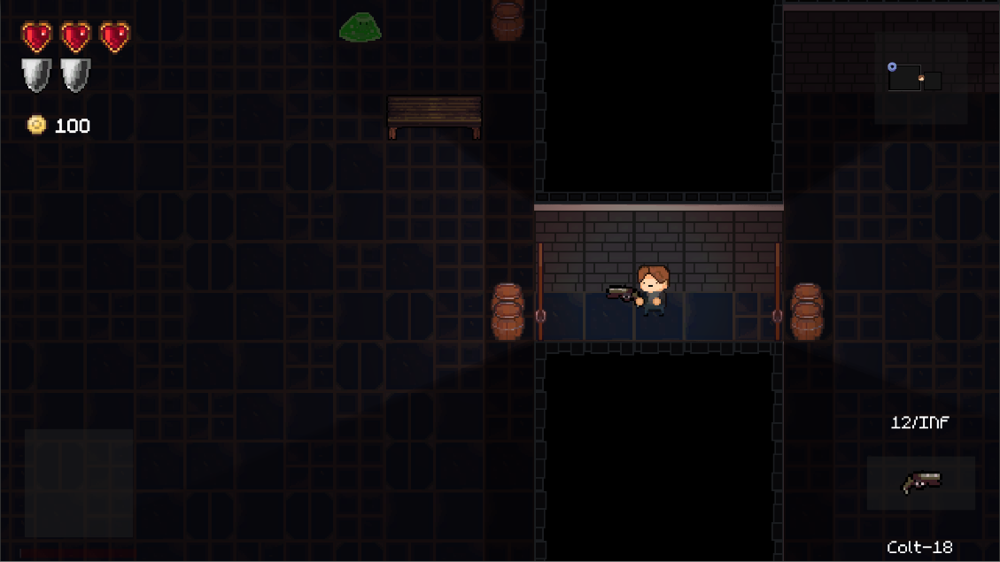

## Enemies! ##
* Several types of enemies such as melee and firerange.
* Bosses! 
* Enemies and there spawn amount can be changed, depending on game stage.
* Enemies are using default unity navmap.

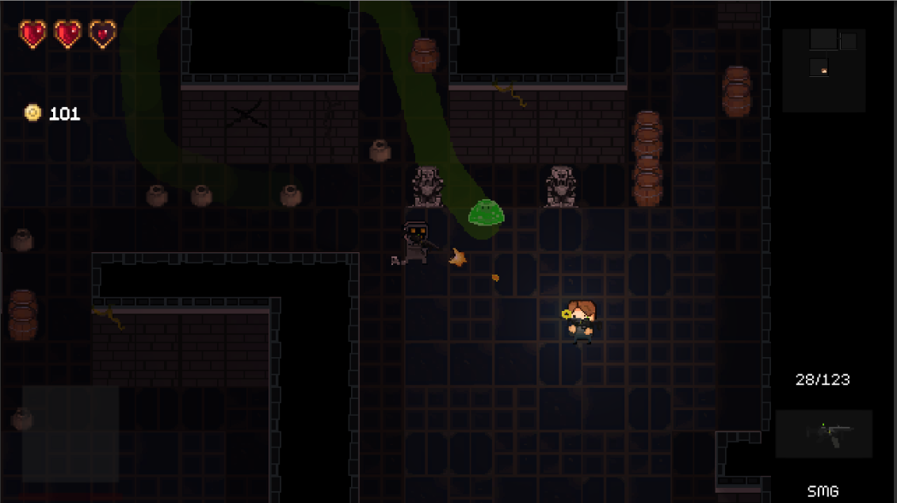
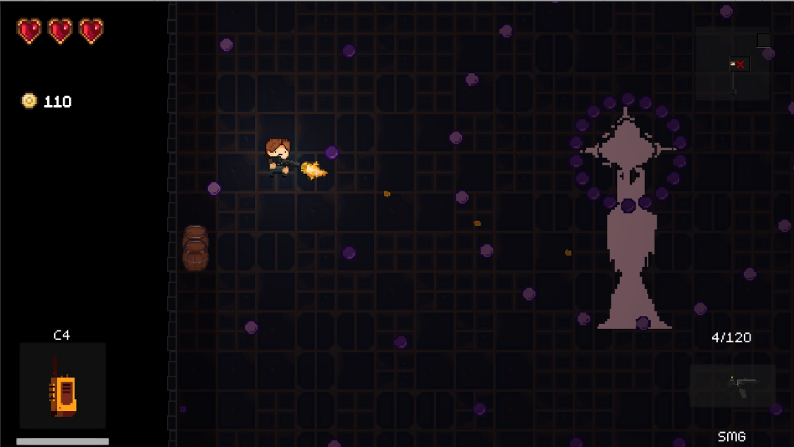

## Weapons! ##
* Laser gun
* Shotgun
* Rocket launcher
* SMG
* Pistol

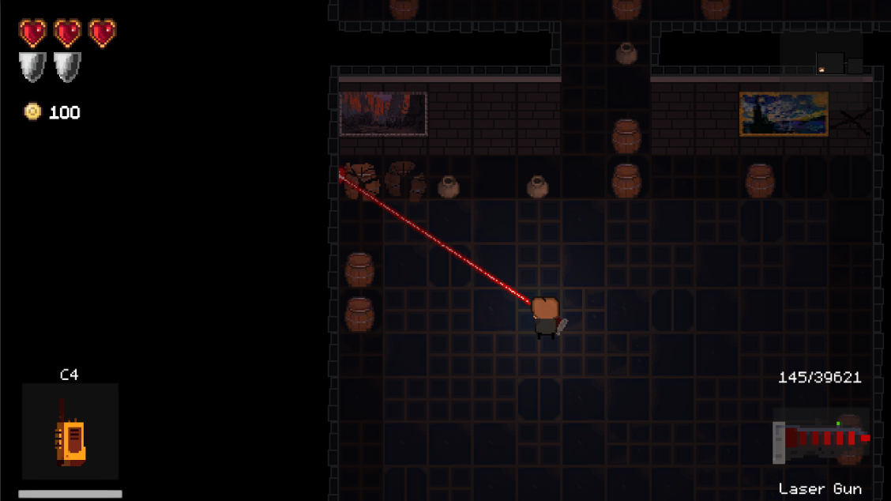

## Items! ##
* Useable: Slow time, C4, invincibility for short time etc.
* Passive: Health, ammo, fire bullets etc.
* Items and there spawn can be changed, depending on game stage.
* Items can be bought in shops or be found in chests.

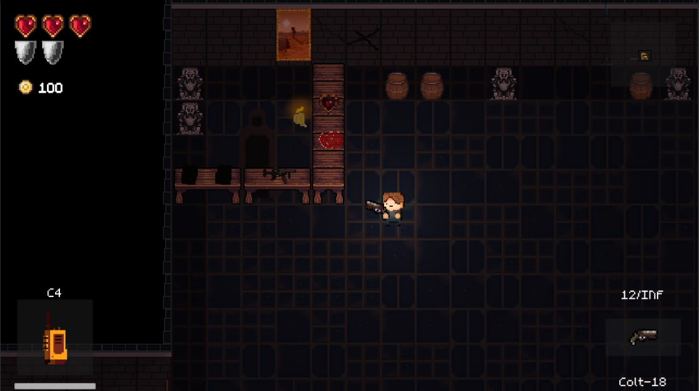

## Dynamic Map & Minimap! ##
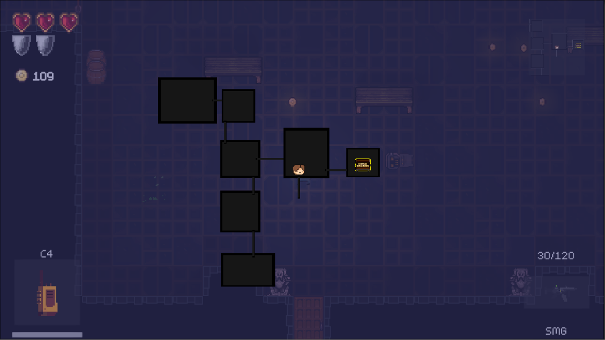
[I'm an inline-style link](https://www.google.com)
## CONTROLS ##
* WASD to move.
* LMB to shoot.
* RMB to dodge.
* 1,2,3,4 - change weapon.
* R - reload weapon.
* E - pick up item/weapon.
* G - drop weapon.
* F - drop item.
* TAB - change items.
* Space - use item.
* M - open map.

## SPECIAL THANKS TO ##
##
  [Light and shadows with SpriteLightKit!](https://github.com/prime31/SpriteLightKit)  
  [Destruction with Unity-2D-Destruction](https://github.com/mjholtzem/Unity-2D-Destruction) 
##
